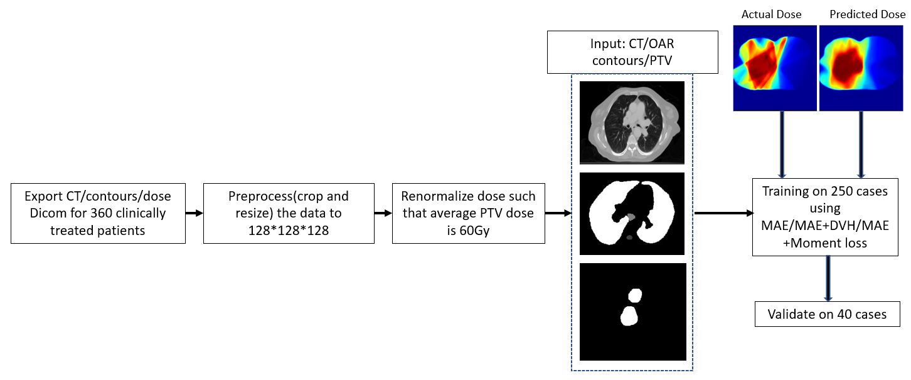
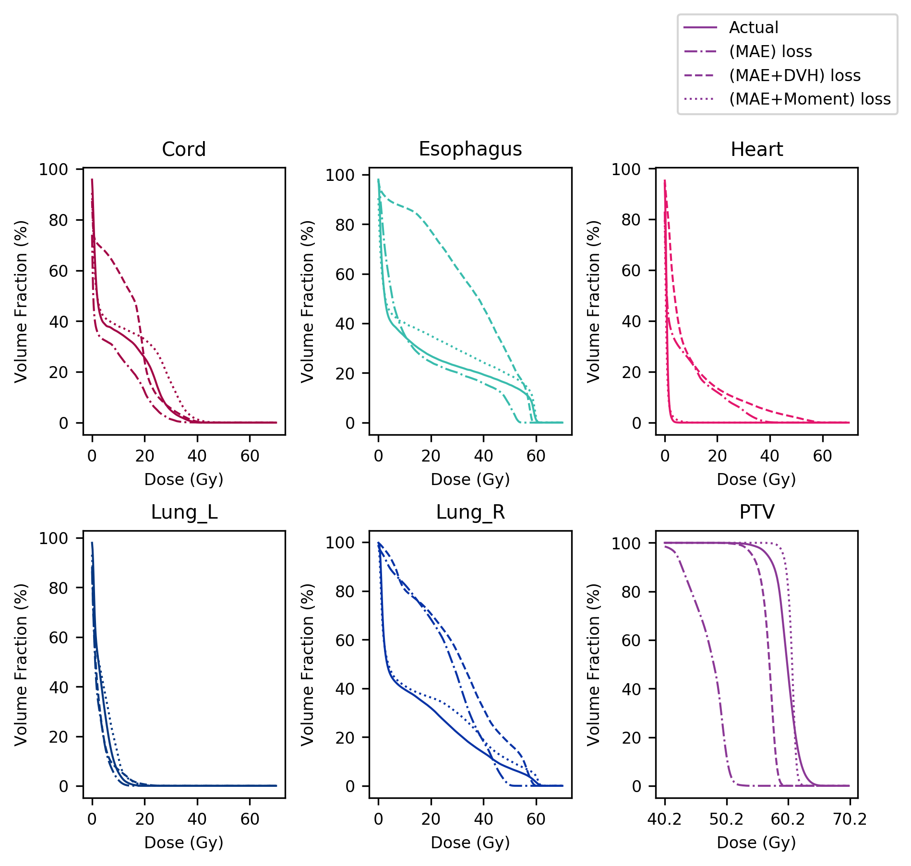

<!-- PROJECT LOGO -->
<br />
<p align="center">
    <h2 align="center"><strong>Domain Knowledge Driven 3D Dose Prediction Using Moment-Based Loss Function</strong></h2>
    <p align="center">
    <a href="https://arxiv.org/pdf/2207.03414.pdf">PMB'22 Paper</a>
    |
    <a href="#installation">Installation</a>
    |
    <a href="#usage">Usage</a>
    |
    <a href="https://github.com/nadeemlab/DoseRTX/issues">Issues</a>
  </p>
</p>


*We propose a novel moment-based loss function for predicting 3D dose distribution for the challenging conventional lung IMRT plans. The moment-based loss function is convex and differentiable and can easily incorporate clinical dose volume histogram (DVH) domain knowledge in any deep learning framework without computational overhead. A large dataset of 360 (240 for training, 50 for validation and 70 for testing) conventional lung patients with 2Gy × 30 fractions was used to train the deep learning (DL) model using clinically treated plans at our institution. A UNet-like CNN architecture was trained using computed tomography (CT), planning target volume (PTV) and organ-at-risk contours (OAR) as input to infer corresponding voxel-wise 3D dose distribution. We evaluated three different loss functions: (1) The popular Mean Absolute Error (MAE) Loss, (2) the recently developed MAE + DVH Loss, and (3) the proposed MAE + Moments Loss. The quality of the predictions was compared using different DVH metrics as well as dose-score and DVH-score, recently introduced by the AAPM knowledge-based planning grand challenge. Model with (MAE + Moment) loss function outperformed the model with MAE loss by significantly improving the DVH-score (11%, p<0.01) while having similar computational cost. It also outperformed the model trained with (MAE+DVH) by significantly improving the computational cost (48%) and the DVH-score (8%, p<0.01). DVH metrics are widely accepted evaluation criteria in the clinic. However, incorporating them into the 3D dose prediction model is challenging due to their non-convexity and non-differentiability. Moments provide a mathematically rigorous and computationally efficient way to incorporate DVH information in any deep learning architecture.*

## Dataset
We used 360 randomly selected lung cancer patients treated with conventional IMRT with 60Gy in 30 fractions at Memorial Sloan Kettering Cancer Center between the year 2017 and 2020. All these patients received treatment and therefore included the treated plans which were manually generated by experienced planners using 5–7 coplanar beams and 6 MV energy. All these plans were generated using EclipseTM V13.7-V15.5 (Varian Medical Systems, Palo Alto, CA, USA).

*Data processing pipeline and training a 3D network to generate a 3D voxelwise dose. OARs are one-hot encoded and concatenated along the channel axis with CT and PTV input to the network.*


## Deep Learning Model For 3D Dose Prediction Using Domain Based Moment Loss Function

*We train a Unet like CNN architecture to output the voxel-wise 3D dose prediction corresponding to an input comprising of 3D CT/contours which are concatenated along the channel dimension. The network follows a common encoder-decoder style architecture which is composed of a series of layers which progressively downsample the input (encoder) using max pooling operation, until a bottleneck layer, where the process is reversed (decoder). Additionally, Unet-like skip connections are added between corresponding layers of encoder and decoder. This is done to share low-level information between the encoder and decoder counterparts. The network (Figure 2) uses Convolution-BatchNorm-ReLU-Dropout as a block to perform series of convolution. Dropout is used with a dropout rate of 50%. Maxpool is used to downsample the image by 2 in each spatial level of encoder. All the convolutions in the encoder are 3×3×3 3D spatial filters with a stride of 1 in all 3 directions. In the decoder we use trilinear upsampling followed by regular 2 × 2 × 2 stride 1 convolution. The last layer in the decoder maps its input to a one channel output (1283, 1).*

## Installation
It is highly recommended to install dependencies in either a python virtual environment or anaconda environment. Instructions for python virtual environment:
Install all the dependencies present in requirements.txt
```bash
python3 -m venv venv
source venv/bin/activate
(venv) pip install -r requirements.txt
```
Please use this [link](https://github.com/facebookresearch/pytorch3d/blob/main/INSTALL.md#3-install-wheels-for-linux) for the details of pytorch3d installation.

## Usage
```bash
git clone --recursive git@github.com:nadeemlab/DoseRTX.git
```
High level usage instructions are detailed below. Detailed instructions at each step, including running pre-trained models, are described in following subsections.

Step 1: You have to first perform data pre-processing using pre-process data module. `python data_preprocess.py --in_dir dicom_input_dir --out_dir output_dir `

Step 2: Now execute `python train.py --dataroot train_data_directory --netG stand_unet --name planName --model doseprediction3d --direction AtoB --lambda_L1 1 --dataset_mode dosepred3d --norm batch --batch_size 1 --pool_size 0 --display_port 8097 --lr 0.0002 --input_nc 7 --output_nc 1 --display_freq 10 --print_freq 1 --gpu_ids 0,1,2` and this will start training the network.

Step 3: Test the trained model. `python test.py --dataroot test_data_directory --netG stand_unet --name planName --phase test --mode eval --model doseprediction3d --input_nc 7 --output_nc 1 --direction AtoB --dataset_mode dosepred3d --norm batch --gpu_ids 1`

### Data Pre-processing
Pre-processed data will be saved in out_dir directory.

Step 1: Provide input directory of patient DICOM. DICOM for the sample patients are available [here](https://zenodo.org/record/6762573)
```bash
tar -xjvf sample_patient_data.tar.bz2
```

Step 2.0: Generate nrrd files using data preprocess

- Pre-processed data is available [here](https://zenodo.org/record/7036132).
```bash
   tar xjvf sample_nrrd_data.tar.bz2
```

Step 2.1: 
- Input: Each case consists of five nrrd files (SimpleITK)  
    1. LUNG1_CT.nrrd                - CT Image  
    2. LUNG1_dose.nrrd              - dose in orginal resolution
    3. LUNG1_dose_resampled.nrrd          - dose mapped to CT orginal resolution  
    4. LUNG1_PTV.nrrd    - PTV mask  
	5. LUNG1_RTSTRUCTS.nrrd    - OAR mask
- Output: Each case consists of six npy files (numpy) - 128x128x128 cubic image patch  
    1. CT.npy           - CT Image  
    2. dose.npy          - Actual dose  
    3. PTV.npy       - PTV mask  
    4. OAR.npy        - OAR mask
	5. hist.npy        - volume at or above a given dose threshold value
	6. bins.npy        - dose thresold values
- Sampled Pre-processed data is available for TCIA lung patients [here](https://zenodo.org/record/6762573).
```bash
   tar xjvf sample_processed_data.tar.bz2
```
  
Step 2.2: Divide datasets into subsets (Training, Validation, Testing)

### Running Pre-trained Models
Download the pretrained model from the links below and put them in checkpoints folder
1. Dose prediction using (MAE) loss is available [here](https://zenodo.org/record/7036132)
```bash
    tar xjvf MAE_loss.tar.bz2
    python test.py --dataroot test_data_directory --netG stand_unet --name MAE_loss --phase test --mode eval --model doseprediction3d --input_nc 7 --output_nc 1 --direction AtoB --dataset_mode dosepred3d --norm batch --gpu_ids 1
```
2. Dose prediction using (MAE + DVH) loss is available [here](https://zenodo.org/record/7036132)
```bash
    tar xjvf MAE_DVH_loss.tar.bz2
    python test.py --dataroot test_data_directory --netG stand_unet --name MAE_DVH_loss --phase test --mode eval --model doseprediction3d --input_nc 7 --output_nc 1 --direction AtoB --dataset_mode dosepred3d --norm batch --gpu_ids 1
```
3. Dose prediction using (MAE + Moment) loss is available [here](https://zenodo.org/record/7036132)
```bash
    tar xjvf MAE_Moment_loss.tar.bz2
    python test.py --dataroot test_data_directory --netG stand_unet --name MAE_Moment_loss --phase test --mode eval --model doseprediction3d --input_nc 7 --output_nc 1 --direction AtoB --dataset_mode dosepred3d --norm batch --gpu_ids 1
```

### Docker
We provide a Dockerfile that can be used to run the models inside a container.
First, you need to install the [Docker Engine](https://docs.docker.com/engine/install/ubuntu/). For using GPU's you also need to install [NVIDIA container toolkit](https://docs.nvidia.com/datacenter/cloud-native/container-toolkit/install-guide.html#docker). After installing the Docker, you need to follow these steps:

1. Clone this repository.
2. To create a docker image from the docker file; from top-level repository directory:
```
cd docker; ./build.sh
```
* Note: You may need to modify lines 1, and 12 of Dockerfile to match your systems' cuda version.
3. Upon successful docker image creation:
* Pre-built docker image including sample data and pre-trained models is available [here](https://hub.docker.com/r/nadeemlab/dosertx) 
```
docker run --gpus all -it nadeemlab/dosertx:latest /bin/bash
```
4. Then run `python test.py --dataroot sample_processed_data --netG stand_unet --name MAE_Moment_loss --phase test --mode eval --model doseprediction3d --input_nc 7 --output_nc 1 --direction AtoB --dataset_mode dosepred3d --norm batch --gpu_ids 1` or  
<br />
`python test.py --dataroot sample_processed_data --netG stand_unet --name MAE_loss --phase test --mode eval --model doseprediction3d --input_nc 7 --output_nc 1 --direction AtoB --dataset_mode dosepred3d --norm batch --gpu_ids 1` or  
<br />
`python test.py --dataroot sample_processed_data --netG stand_unet --name MAE_DVH_loss --phase test --mode eval --model doseprediction3d --input_nc 7 --output_nc 1 --direction AtoB --dataset_mode dosepred3d --norm batch --gpu_ids 1` 
<br />
for testing either of the three pre-trained models on the sample patient data. The resulting dose prediction will be in the ./results directory.

### Results [PMB'22]
The following bar charts shows evaluation of different DVH metrics using models trained with MAE, (MAE + DVH), and (MAE+Moment) losses (as **reported in the paper**).


  

*Comparison of different metrics for (a) MAE vs (MAE + Moment) and (b) (MAE+ DVH) vs (MAE + Moment) losses. Y axis shows the relative improvement(in %) using (MAE+Moment) loss compared to MAE and (MAE+DVH) loss. The higher is always better. For statistical analysis, Wilcoxon signed-rank test was used and p = 0.05 was considered statistically significant.*

*Comparison of DVH metrics using different loss functions for the above sample patient. As can been seen, in general, the prediction generated with (MAE + Moment) loss resembles the actual ground-truth dose more than the other models, for this particular patient, especially for Cord, Esophagus, Heart, Lung_R and PTV.*

## Reference
If you find our work useful in your research or if you use parts of this code or the dataset, please cite the following paper:
```
@article{jhanwar2022domain,
  title={Domain knowledge driven 3D dose prediction using moment-based loss function},
  author={Jhanwar, Gourav and Dahiya, Navdeep and Ghahremani, Parmida and Zarepisheh, Masoud and Nadeem, Saad},
  journal={Physics in Medicine \& Biology},
  year={2022},
  publisher={IOP Publishing}
}

```
